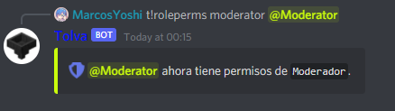

# Moderación

## Configuración de roles

Lo primero que haremos será configurar el rol del de los moderadores mediante el comando

```javascript
t!roleperms moderator [@Moderador | RoleID]
```




Para usar este comando requieres permisos de ADMINISTRADOR.


